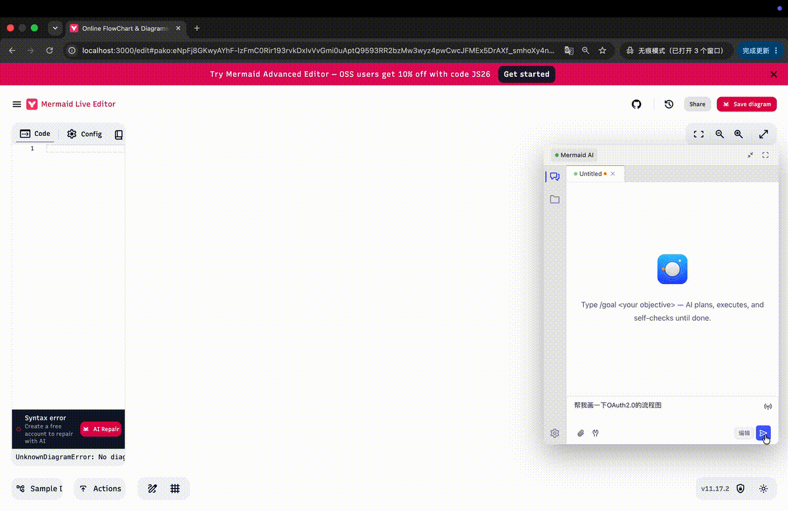

# Mermaid Live Editor × RTC-Agent

<div align="center">

**用 AI 重新定义图表创作**

[](https://rtc-agent.github.io/mermaid-live-editor)
[](https://github.com/rtc-agent/web-components)



</div>

---

## ✨ 全新功能

Mermaid Live Editor 现已集成 **RTC-Agent**，将 AI 驱动的图表创建能力直接带入浏览器。只需用自然语言描述你想绘制的内容，AI 就会实时创建、验证并优化你的 Mermaid 图表。

### 🎯 核心能力

| 功能              | 说明                             |
| :---------------- | :------------------------------- |
| 🗣️ **自然语言**   | 用日常英语描述图表，无需记忆语法 |
| 🔄 **实时验证**   | AI 自动检查语法错误并修复        |
| 📝 **场景模板**   | 为常见图表类型提供预置工作流     |
| 🎨 **主题同步**   | 无缝适配亮色/暗色模式            |
| 🔌 **可扩展 API** | 为自定义工具集成提供编程接口     |

---

## 🚀 快速开始

### 1. 加载编辑器

RTC-Agent 组件通过 CDN 自动加载：

```html
<script
  type="module"
  src="https://cdn.jsdelivr.net/npm/@rtc-agent/component@0.1.2-rc4/dist/index.js"></script>
```

### 2. 配置 Agent

在你的布局文件中，为 agent 配置编辑器工具：

```typescript
const agent = document.querySelector<RtcAgent>('rtc-agent');

agent.addEventListener(
  'rtc-agent-ready',
  () => {
    agent.agentConfig = {
      name: 'MermaidEditor',
      description: 'AI assistant for creating diagrams',
      persona: 'You are a helpful Mermaid diagram assistant...',
      groups: [
        {
          name: 'editor',
          description: 'Editor operations',
          functions: [
            {
              name: 'getCode',
              description: 'Get current Mermaid code',
              handler: () => window.editorAPI.getCode()
            },
            {
              name: 'setCode',
              description: 'Replace editor content',
              handler: (params) => window.editorAPI.setCode(params.code),
              parameters: [{ name: 'code', required: true, schema: { type: 'string' } }]
            },
            {
              name: 'validate',
              description: 'Check for syntax errors',
              handler: () => window.editorAPI.validate()
            }
          ]
        }
      ]
    };
  },
  { once: true }
);
```

### 3. 使用 AI 助手

点击编辑器中的 **Mermaid AI** 按钮，开始对话：

> "创建一个用户登录流程图：开始 → 输入凭证 → 验证 → 成功进入仪表盘，失败显示错误并循环"

AI 会生成 Mermaid 代码、验证语法，并即时显示图表。

---

## 🏗️ 架构设计

```
┌─────────────────────────────────────────────────────────────┐
│                    Mermaid Live Editor                       │
├─────────────────────────────────────────────────────────────┤
│                                                              │
│  ┌──────────────┐         ┌──────────────┐                  │
│  │   Monaco     │◄────────┤  editorAPI   │                  │
│  │   Editor     │         │  (window)    │                  │
│  └──────────────┘         └──────┬───────┘                  │
│                                   │                          │
│                                   ▼                          │
│  ┌──────────────────────────────────────────────────────┐   │
│  │              <rtc-agent> Web Component                │   │
│  │  ┌────────────────────────────────────────────────┐  │   │
│  │  │  Agent Config                                   │  │   │
│  │  │  • name: "MermaidEditor"                       │  │   │
│  │  │  • persona: "Helpful Mermaid assistant..."     │  │   │
│  │  │  • groups: [editor.getCode, setCode, ...]      │  │   │
│  │  └────────────────────────────────────────────────┘  │   │
│  └──────────────────────────────────────────────────────┘   │
│                                   │                          │
└───────────────────────────────────┼──────────────────────────┘
                                    │
                                    ▼
                    ┌───────────────────────────────┐
                    │   RTC-Agent Server            │
                    │   (rtc-agent.cherish.chat)    │
                    │                               │
                    │   • LLM 编排                  │
                    │   • 工具执行                  │
                    │   • 对话历史                  │
                    └───────────────────────────────┘
```

### 集成点说明

| 组件                 | 职责                                                                                  |
| :------------------- | :------------------------------------------------------------------------------------ |
| **`editorAPI.ts`**   | 在 `window` 上暴露 `getCode`、`setCode`、`validate`、`getDiagramType`、`waitForReady` |
| **`+layout.svelte`** | 加载 RTC-Agent 脚本，配置 agent 工具，同步主题                                        |
| **`rtc-agent.d.ts`** | 为类型安全集成提供 TypeScript 声明                                                    |
| **`scenarios/`**     | 展示常见工作流的 Markdown 模板                                                        |

---

## 📚 API 参考

### Editor API

`window.editorAPI` 对象提供对编辑器的编程访问：

```typescript
interface EditorAPI {
  getCode(): string; // 获取当前代码
  setCode(code: string): void; // 设置代码并触发验证
  validate(): ValidateResult; // 验证当前代码
  getDiagramType(): string | undefined; // 获取图表类型
  waitForReady(): Promise<void>; // 等待验证完成
}

interface ValidateResult {
  valid: boolean;
  diagramType?: string;
  error?: { message: string; markers: MarkerData[] };
}
```

### Agent 配置

```typescript
interface RtcAgentConfig {
  name?: string; // Agent 标识符
  description?: string; // Agent 用途描述
  persona?: string; // 系统提示词
  groups?: FunctionGroup[]; // 工具定义
}

interface FunctionGroup {
  name: string;
  description?: string;
  functions: FunctionDef[];
}

interface FunctionDef {
  name: string;
  description: string;
  handler: (params: any) => any;
  parameters?: ParameterDef[];
  returns?: { schema: Record<string, any> };
}
```

---

## 🎬 演示场景

预构建场景位于 `static/rtc-agent/scenarios/`：

| 场景             | 说明                        |
| :--------------- | :-------------------------- |
| **创建流程图**   | 从自然语言描述构建流程图    |
| **创建时序图**   | 为系统交互生成时序图        |
| **修复语法错误** | 检测并修正 Mermaid 语法问题 |

每个场景都包含分步说明和预期结果。

---

## 🔧 开发指南

### 本地开发模式

在开发编辑器时同时开发 RTC-Agent：

```bash
# 本地构建 RTC-Agent
cd ../web-components && pnpm build

# 切换编辑器到本地模式
pnpm rtc-agent:local

# 启动开发服务器
pnpm dev
```

### 生产模式

生产环境切换回 CDN：

```bash
pnpm rtc-agent:cdn
pnpm build
```

---

## 📊 集成时间线

| 提交       | 变更                          |
| :--------- | :---------------------------- |
| `65341a08` | 初始 CDN 集成                 |
| `3062b9de` | 配置 GitHub Pages 基础路径    |
| `071ee4c1` | 为 RTC-Agent URL 使用基础路径 |
| `fe0691e9` | 最终版本：0.1.2-rc4           |

---

## 🤝 贡献指南

欢迎各种形式的贡献：

- 🐛 Bug 报告
- 💡 功能请求
- 📝 文档改进
- 🎨 新的场景模板

请提交 Issue 或 Pull Request。

---

## 📄 许可证

本项目采用 MIT 许可证。

---

<div align="center">

**由 RTC-Agent 社区用 ❤️ 打造**

[在线编辑器](https://rtc-agent.github.io/mermaid-live-editor) · [文档](https://rtc-agent.github.io/docs/)

</div>
