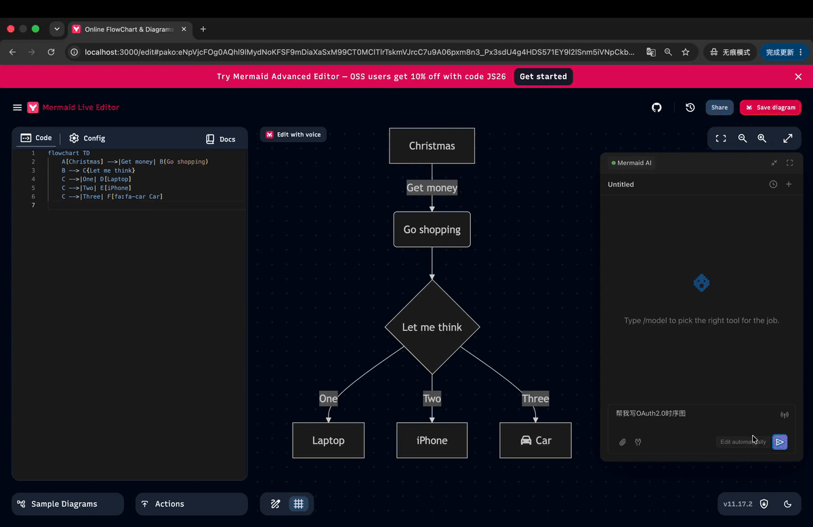

<!-- markdownlint-disable MD033 MD041 MD036 MD032 MD040 MD060 MD034 -->
<div align="center">

# 🤖 Mermaid Live Editor × rtc-agent

**让 AI 直接操作你的前端 —— 一个 Fork 就够了**

[](https://github.com/mermaid-js/mermaid-live-editor)
[](https://github.com/rtc-agent)
[](./LICENSE)

[✨ 效果演示](#-效果演示) · [🚀 30 秒接入](#-30-秒接入你的项目) · [📖 接入原理](#-接入原理) · [🎯 任何前端项目](#-任何前端项目都能接入)

</div>

---

## 📌 这是什么？

本项目是 [mermaid-js/mermaid-live-editor](https://github.com/mermaid-js/mermaid-live-editor) 的一个 **fork**，唯一目的是演示如何把 [**rtc-agent**](https://github.com/rtc-agent) 接入一个真实的前端项目。

> **rtc-agent** 是一个 Web Component 形式的 AI Agent 运行时。把它丢进任何前端项目，AI 就能通过自然语言直接操控你的 UI：读写编辑器、校验语法、调用 API、生成内容……

本仓库 **不修改上游任何源码**，只通过少量"胶水代码"完成接入。这些胶水代码可以原封不动地搬到你的 React / Vue / Svelte / 原生 HTML 项目里。

---

## 🎬 效果演示

<div align="center">
  
</div>

**你能看到的：**

- 🗣️ 用户用自然语言描述想要的图表
- ✍️ AI 自动在编辑器里写入 Mermaid 代码
- ✅ AI 主动调用校验，发现错误后自修复
- 🎨 整个过程用户不需要手写一行代码

---

## 🚀 30 秒接入你的项目

接入 rtc-agent 只需要 **3 件事**，总共不到 30 行代码：

### 1️⃣ 加载 rtc-agent（一行 HTML）

```html
<script
  type="module"
  src="https://cdn.jsdelivr.net/npm/@rtc-agent/component@0.1.0/dist/index.js"></script>

<rtc-agent app-label="My App"></rtc-agent>
```

### 2️⃣ 暴露你应用的状态 API

```ts
// 把你应用的关键状态挂到 window 上，让 Agent 能读写
window.editorAPI = {
  getCode: () => editor.getValue(),
  setCode: (code) => editor.setValue(code),
  validate: () => runValidation()
};
```

### 3️⃣ 声明 Agent 的身份 + 工具

```ts
document.querySelector('rtc-agent').agentConfig = {
  name: 'MyAssistant',
  persona: '你是一个友好的助手...',
  groups: [
    {
      name: 'editor',
      functions: [
        { name: 'getCode', handler: () => window.editorAPI.getCode() /* ... */ },
        { name: 'setCode', handler: (p) => window.editorAPI.setCode(p.code) /* ... */ },
        { name: 'validate', handler: () => window.editorAPI.validate() /* ... */ }
      ]
    }
  ]
};
```

**完成。** 对话面板、工具调用、上下文管理全部由 `<rtc-agent>` 接管，宿主零侵入。

---

## 📖 接入原理

```
┌──────────────────────────────────────────────────────────┐
│                      浏览器                              │
│                                                          │
│   ┌─────────────────┐        ┌───────────────────────┐  │
│   │  你的前端应用    │        │  <rtc-agent>          │  │
│   │                 │        │  ┌─────────────────┐  │  │
│   │  window.xxxAPI  │◄───────┤  │  AI Agent 核心  │  │  │
│   │  (你暴露的)     │ handler│  │  对话 / LLM /   │  │  │
│   │                 │        │  │  工具调度        │  │  │
│   │  内部状态       │        │  └─────────────────┘  │  │
│   │  (完全保留)     │        └───────────────────────┘  │
│   └─────────────────┘                                   │
└──────────────────────────────────────────────────────────┘
```

**三个关键解耦：**

| 关注点         | 谁负责             | 说明                                           |
| -------------- | ------------------ | ---------------------------------------------- |
| **Agent 核心** | `<rtc-agent>` 自带 | 对话、LLM 调用、工具调度，UMD 独立打包         |
| **宿主状态**   | 你的应用           | 编辑器代码、表单、业务数据，rtc-agent 完全不碰 |
| **工具绑定**   | 你在宿主侧配置     | 通过 `agentConfig` 声明，Agent 侧无需重新打包  |

所以"接入"实际上只是：**给 rtc-agent 一个可调用的程序化接口，并告诉它"你是谁、能做什么"**。

---

## 📁 本仓库的改动清单

整个接入只动了 **5 个文件**，对比上游 ~300 个源文件，**改动率 < 2%**：

| 文件                                                             | 改动                                           | 行数         |
| ---------------------------------------------------------------- | ---------------------------------------------- | ------------ |
| [`src/routes/+layout.svelte`](./src/routes/+layout.svelte)       | 加载 CDN、挂载组件、配置 agentConfig、同步主题 | +98          |
| [`src/lib/util/editorAPI.ts`](./src/lib/util/editorAPI.ts)       | 暴露 `window.editorAPI` 程序化接口             | +105（新增） |
| [`src/rtc-agent.d.ts`](./src/rtc-agent.d.ts)                     | rtc-agent TypeScript 类型声明                  | +121（新增） |
| [`src/lib/util/state.svelte.ts`](./src/lib/util/state.svelte.ts) | 加 `onValidationDone` 钩子                     | +9           |
| `static/auth/callback.html`                                      | OAuth 回调页                                   | 新增         |
| `static/rtc-agent/scenarios/`                                    | 3 个 Agent 场景 + manifest                     | 新增         |

> 💡 **不需要提交 3MB 的 bundle** —— rtc-agent 通过 jsDelivr CDN 加载，仓库只保留几 KB 的配置文件。

---

## 🎯 任何前端项目都能接入

rtc-agent 是 **框架无关** 的 Web Component。不管你用什么技术栈，接入方式都一样：

| 框架               | 状态          |
| ------------------ | ------------- |
| React / Next.js    | ✅            |
| Vue / Nuxt         | ✅            |
| Svelte / SvelteKit | ✅ 本仓库就是 |
| Angular            | ✅            |
| 原生 HTML / jQuery | ✅            |
| Electron / Tauri   | ✅            |
| Astro / VitePress  | ✅            |

**判断你的项目能不能接入的唯一标准**：你能不能往页面里挂一段 `<script>` 标签 + 一个自定义元素 `<rtc-agent>`？如果能，就能接入。

---

## 🔗 相关链接

| 资源                      | 链接                                                                  |
| ------------------------- | --------------------------------------------------------------------- |
| 上游 Mermaid Live Editor  | https://github.com/mermaid-js/mermaid-live-editor                     |
| 在线体验（mermaid 官方）  | https://mermaid.live                                                  |
| rtc-agent 组织            | https://github.com/rtc-agent                                          |
| npm: @rtc-agent/component | https://www.npmjs.com/package/@rtc-agent/component                    |
| CDN: jsDelivr             | https://cdn.jsdelivr.net/npm/@rtc-agent/component@0.1.0/dist/index.js |

---

## 📄 License

与上游 [mermaid-live-editor](https://github.com/mermaid-js/mermaid-live-editor) 保持一致，详见 [LICENSE](./LICENSE)。

---

<div align="center">

**Made with ❤️ by the rtc-agent team**

_如果这个项目帮到了你，给个 ⭐ 支持一下~_

</div>
