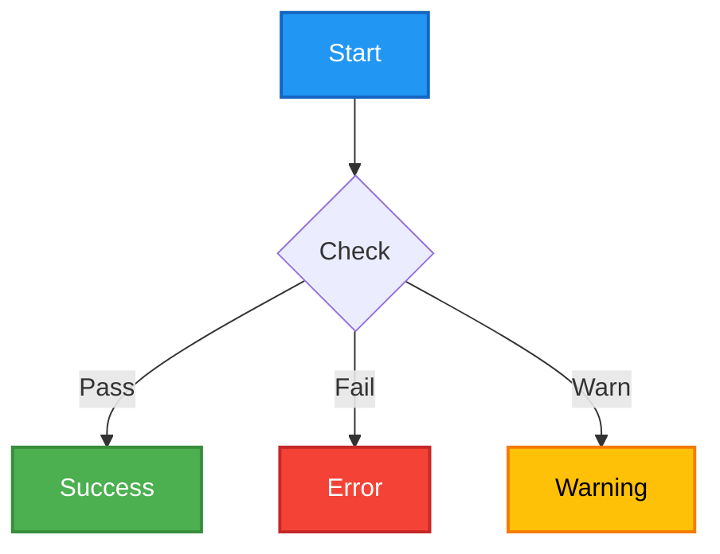
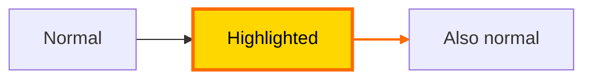
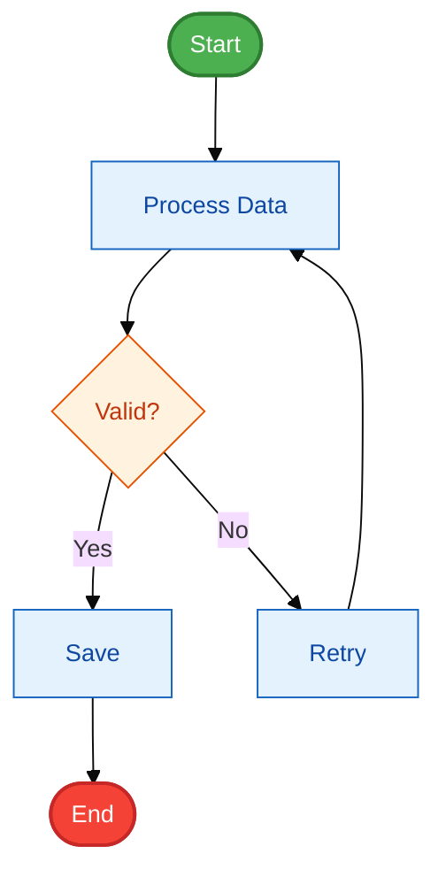

# Style a Diagram

## Goal

Demonstrate how to apply custom styles to Mermaid diagrams using themes, class definitions, and inline styles.

## Mermaid Styling Syntax Reference

### 1. Theme Configuration (init directive)

Use `%%{init:}%%` at the top of the diagram to configure the theme:

**Available themes**: `default`, `neutral`, `dark`, `forest`, `base`

**Common themeVariables**:
- `primaryColor` — Main node fill color
- `primaryTextColor` — Text color inside nodes
- `primaryBorderColor` — Node border color
- `lineColor` — Arrow/line color
- `secondaryColor` — Secondary elements
- `tertiaryColor` — Background/accent color
- `fontSize` — Base font size

### 2. Class Definitions (classDef)

Define reusable style classes with `classDef`:

**classDef syntax**: `classDef className prop1:value1,prop2:value2,...`

**Common properties**:
- `fill` — Background color (hex, rgb, or named)
- `stroke` — Border color
- `stroke-width` — Border thickness
- `color` — Text color
- `font-size` — Font size
- `font-weight` — bold/normal
- `rx` / `ry` — Corner radius (for rounded corners)
- `opacity` — Transparency (0-1)

### 3. Inline Styles (style)

Apply styles directly to specific nodes or edges:

**style syntax**: `style nodeId prop1:value1,prop2:value2,...`
**linkStyle syntax**: `linkStyle edgeIndex prop1:value1,prop2:value2,...`

### 4. Combined Example

## Steps

1. **Request styling** — Tell the assistant: "Create a flowchart for a deployment pipeline and style it nicely with colors"
2. **Generate styled code** — The assistant should:
   - Add `%%{init:}%%` directive with theme configuration
   - Use `classDef` to define semantic style classes (success, error, warning, etc.)
   - Apply classes to nodes using `:::className` or `class` keyword
3. **Validate** — The assistant calls `editor.validate` to ensure syntax is correct
4. **Review** — Check that the diagram renders with the expected colors and styles

## Expected Result

- A flowchart with colored nodes based on their semantic meaning
- Consistent styling across similar node types
- Custom theme colors applied globally
- No syntax errors

## Tips for Beautiful Diagrams

1. **Use semantic colors**: Green for success/start, Red for errors/end, Blue for process, Orange for decisions
2. **Maintain contrast**: Ensure text is readable against background colors
3. **Be consistent**: Use the same style class for similar node types
4. **Use themes**: The `base` theme with custom `themeVariables` is most flexible
5. **Rounded corners**: Add `rx:10,ry:10` to classDef for rounded rectangles

## Functions Used

- `editor.setCode`
- `editor.validate`
